# Online Voting Platform

- A prototype project for creating elections and hosting them with a dashboard [Capstone project for WD 201] 

- Web application service hosted on: [Render](https://online-voting-platform-aravind.onrender.com/)

## Technologies used

- Embedded Javascript
- Javascript
- Tailwind CSS
- Postgres
- Render

## Demo video
[Watch video demo](https://www.loom.com/share/0250ee8da63c4217a1d502e2358ae921) on Loom

## Screenshots

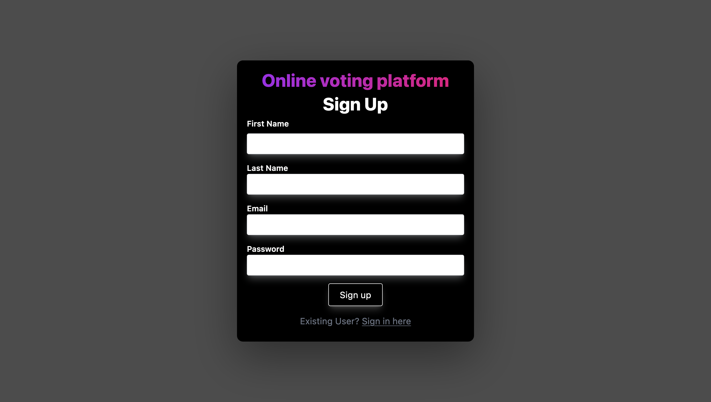
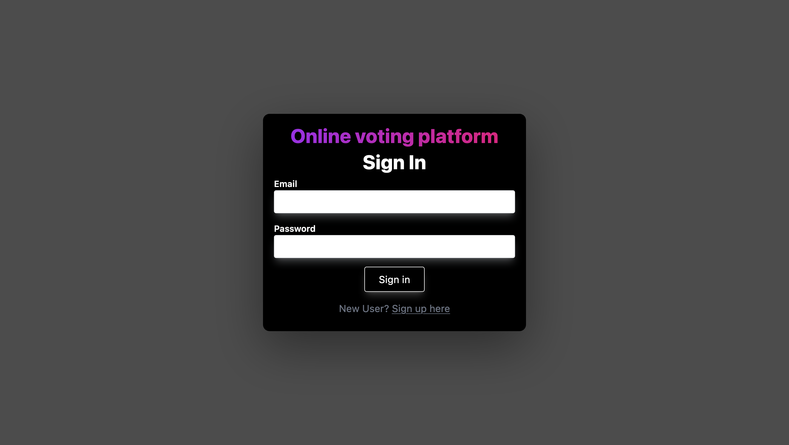
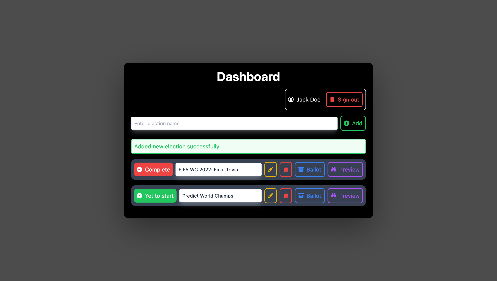
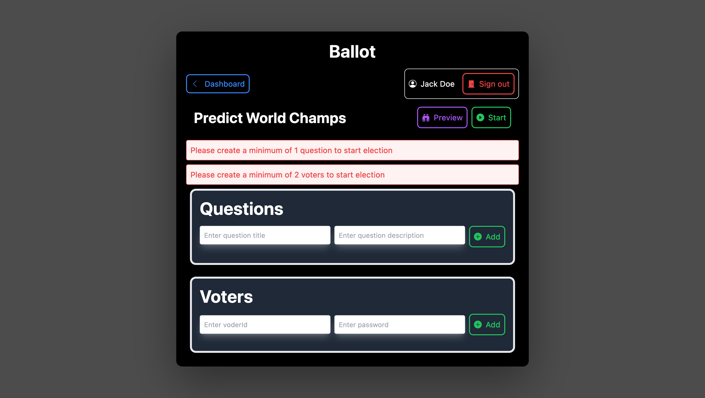
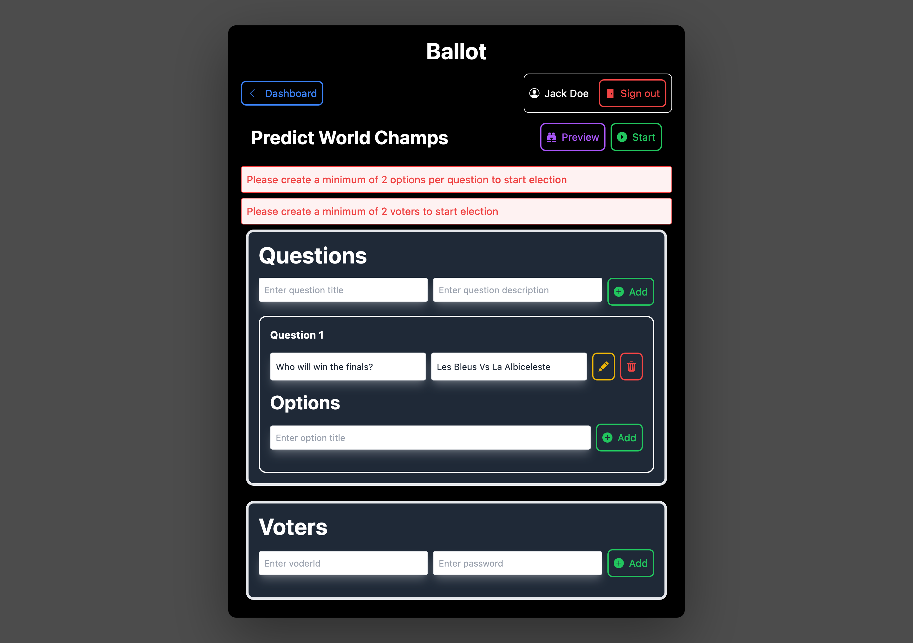
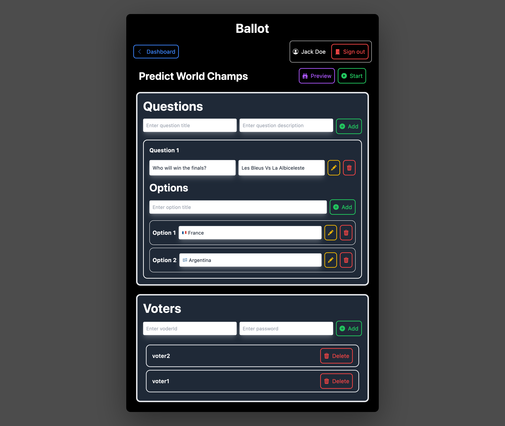
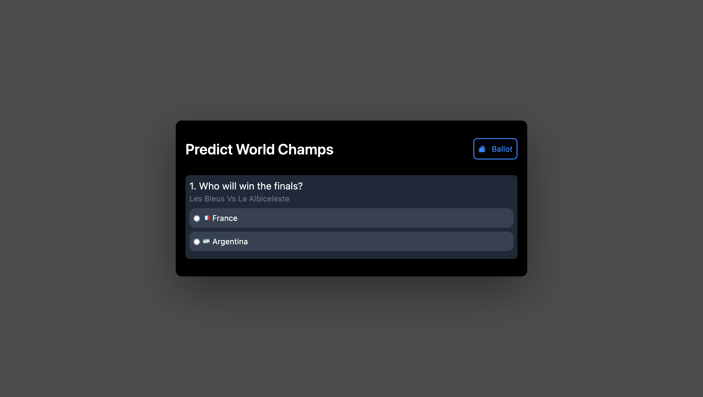
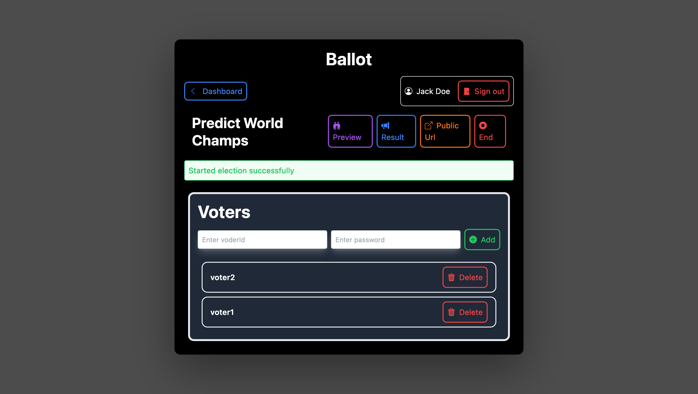
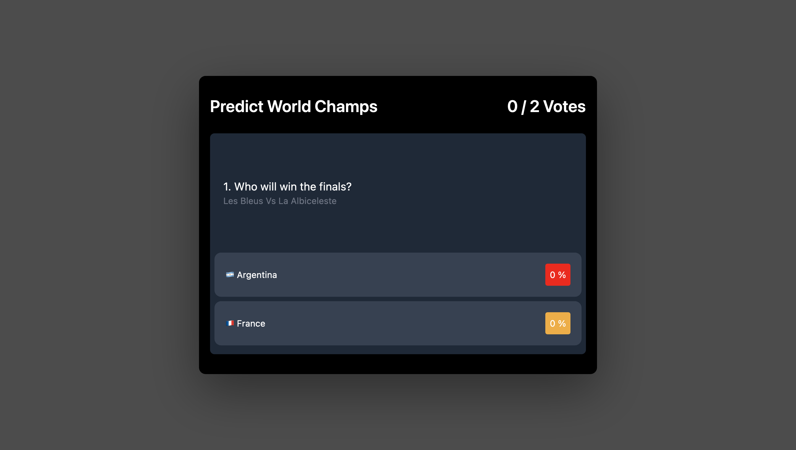
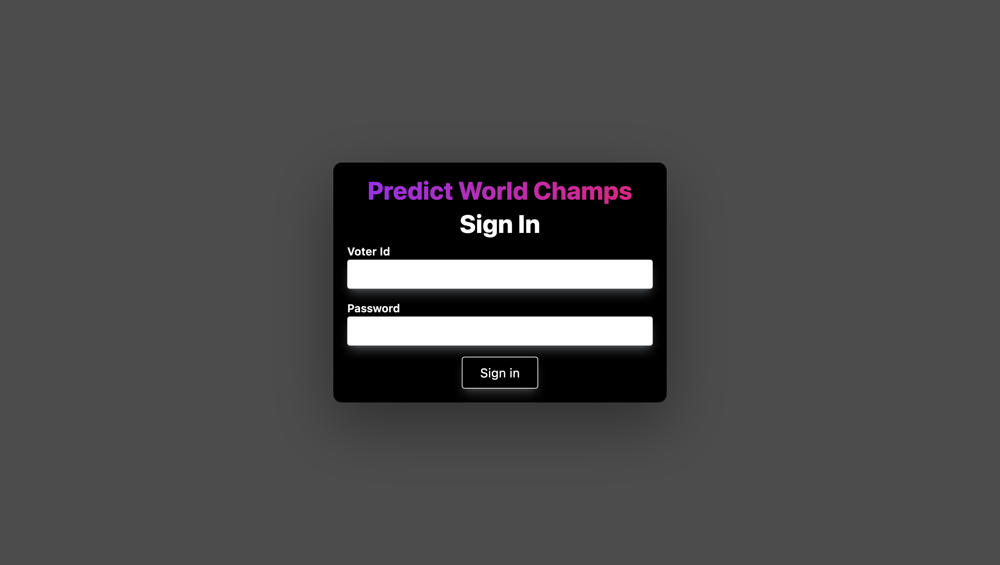
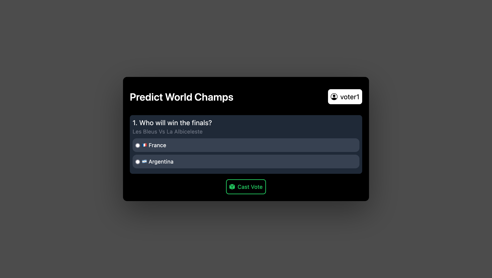
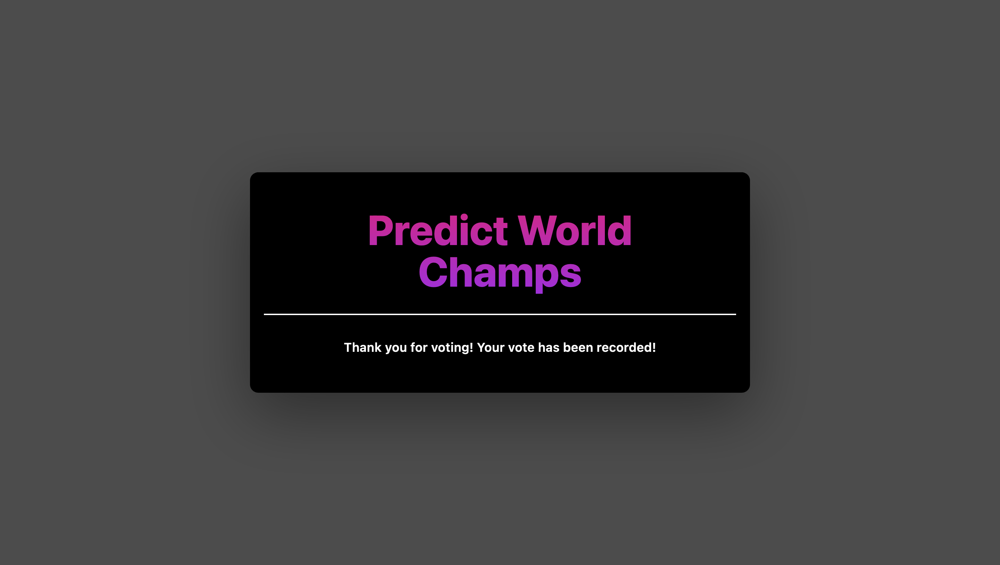
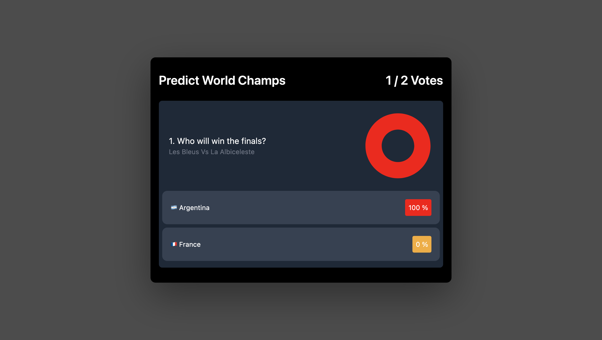